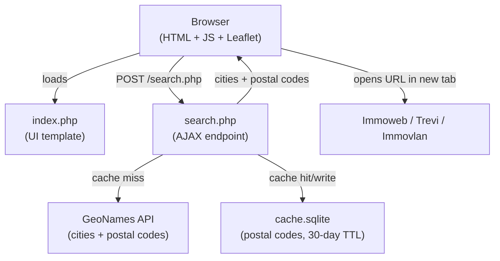
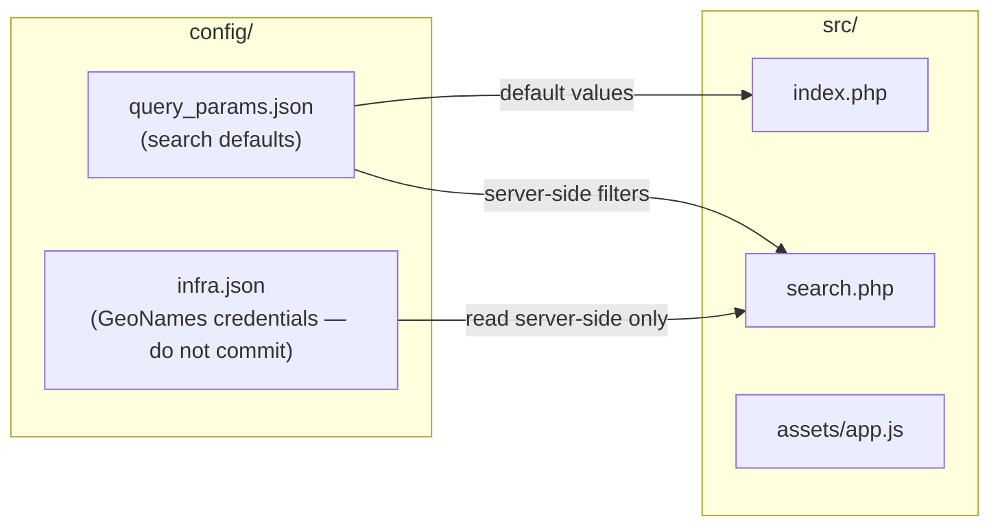

# Maizoek

> **Made in Belgium** — *maison* (French for "house") + *zoeken* (Dutch for "to search"). Two languages, one compromise — the Belgian way of doing things.

> **Vibe-coded project** — I wrote zero lines of code myself. The entire codebase was generated by Claude AI, which I supervised and directed.

> **Using Claude Code?** See [`CLAUDE.md`](CLAUDE.md) for architecture notes and conventions optimised for AI-assisted development.

## The Problem

Belgian real estate sites like **Immoweb**, **Trevi**, and **Immovlan** require you to select cities manually — one by one. There is no way to define a geographic zone: you have to know in advance every city you want to include and add each of them individually. If you want to search across a region, that quickly becomes tedious and error-prone.

**Maizoek** automates that. You define your zone precisely (center city, radius, compass arc, region, population threshold), and the app finds all matching towns via the GeoNames API. It then generates ready-to-use search URLs for Immoweb, Trevi, and Immovlan — pre-filled with every city found, so you just click and search.

## Architecture





## Features

- **Precise geographic search** — center + radius + compass arc + Belgian region (WAL / VLG / BRU)
- **Population filter** — skip villages below a threshold, or disable it entirely
- **One-click search links** — Immoweb, Trevi, Immovlan (Trevi hidden automatically for rentals)
- **Interactive map** — Leaflet.js shows found cities on a map
- **Cities list** — full list of matching cities with postal codes
- **Multilingual UI** — FR / EN / NL, switchable via button or `?lang=xx`
- **Cookie persistence** — your search settings are saved across sessions
- **SQLite cache** — postal codes are cached locally for 30 days to preserve GeoNames quota
- **Countries** — Belgium (default), France, Netherlands, Luxembourg

## Prerequisites

- PHP **8.5** or higher
- PHP extensions: `sqlite3`, `curl`
- A free [GeoNames account](https://www.geonames.org/login)

## Installation

1. Upload the contents of the `src/` directory to your web host (OVH or any PHP host).
2. Copy `src/config/infra.json.example` to `src/config/infra.json` and fill in your GeoNames username:
   ```sh
   cp src/config/infra.json.example src/config/infra.json
   ```
3. Edit `src/config/query_params.json` to set your default search parameters (see below).
4. Make sure the `cache.sqlite` file (created automatically at first run) is writable by the web server.

> **Important:** `infra.json` contains credentials and should never be committed to version control.

## Configuration

### `config/query_params.json` — Search defaults

```json
{
  "language": "fr",
  "address": "Liège",
  "radius": 30,
  "dir_from": "SouthWest",
  "dir_to": "North",
  "min_population": 2000,
  "ignore_population": false,
  "country": "BE",
  "regions": ["WAL"],
  "immoweb": {
    "transaction": "for-sale",
    "property_type": "house",
    "property_subtypes": ["HOUSE", "VILLA"],
    "min_price": 400000,
    "max_price": 800000,
    "min_bedrooms": 4,
    "max_bedrooms": null,
    "epc_scores": ["A++", "A+", "A", "B", "C"]
  }
}
```

### Geographic parameters

| Parameter | Description |
|-----------|-------------|
| `address` | Center city of the search |
| `radius` | Search radius in km |
| `dir_from` / `dir_to` | Compass arc (clockwise) |
| `min_population` | Minimum city population (GeoNames data) |
| `ignore_population` | `true` to include all places regardless of population |
| `country` | `BE`, `FR`, `NL`, or `LU` |
| `regions` | `["WAL"]`, `["VLG"]`, `["BRU"]`, or `[]` for all |

**Compass directions:** `North`, `NorthEast`, `East`, `SouthEast`, `South`, `SouthWest`, `West`, `NorthWest`

**Belgian regions:**

| Code | Region |
|------|--------|
| `WAL` | Wallonia |
| `VLG` | Flanders |
| `BRU` | Brussels Capital |

### Immoweb parameters

| Parameter | Description |
|-----------|-------------|
| `transaction` | `for-sale` or `for-rent` |
| `property_type` | `house` or `apartment` |
| `property_subtypes` | Array of subtypes (see below) |
| `min_price` / `max_price` | Price range in € (`null` to disable) |
| `min_bedrooms` / `max_bedrooms` | Bedroom count (`null` to disable) |
| `epc_scores` | EPC/PEB ratings to include (`null` to disable) |

**Available subtypes:** `HOUSE`, `VILLA`, `MANSION`, `MANOR_HOUSE`, `CHALET`, `FARMHOUSE`, `EXCEPTIONAL_PROPERTY`, `TOWN_HOUSE`, `CASTLE`, `BUNGALOW`, `COUNTRY_COTTAGE`, `PAVILION`

**EPC scores:** `A++`, `A+`, `A`, `B`, `C`, `D`, `E`, `F`

## File Structure

| File | Description |
|------|-------------|
| `src/index.php` | Main page (PHP template + HTML) |
| `src/search.php` | AJAX endpoint — queries GeoNames, returns cities and postal codes |
| `src/assets/app.js` | Client-side JS (URL builders, map, filters) |
| `src/assets/app.css` | Styles |
| `src/config/query_params.json` | Default search parameters |
| `src/config/infra.json` | GeoNames credentials (not in repo — see `infra.json.example`) |
| `src/config/translations.json` | UI translations (FR, EN, NL) |
| `cache.sqlite` | SQLite cache for postal codes (auto-created) |
