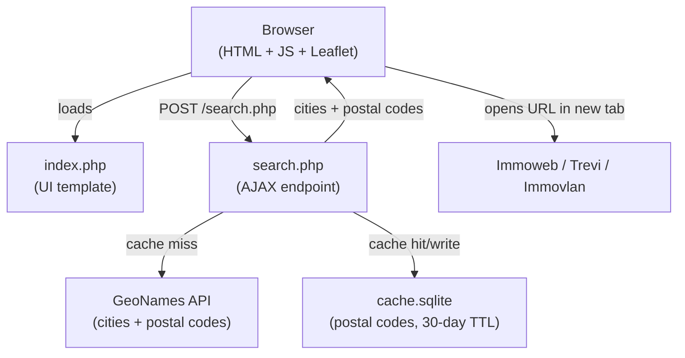
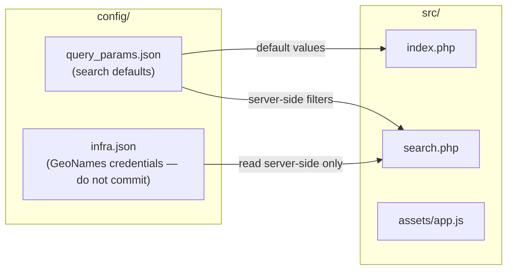

# immo-zone-search

> A geographic zone search tool for Belgian real estate sites. Define a center, radius, compass arc, and region — the app finds all matching towns and generates ready-to-use search URLs for Immoweb, Trevi, and ImmoVlan.

> **Vibe-coded project** — I wrote zero lines of code myself. The entire codebase was generated by Claude AI, which I supervised and directed.

> **Using Claude Code?** See [`CLAUDE.md`](CLAUDE.md) for architecture notes and conventions optimised for AI-assisted development.

## The Problem

Belgian real estate sites like **Immoweb**, **Trevi**, and **Immovlan** require you to select cities manually — one by one. There is no way to define a geographic zone: you have to know in advance every city you want to include and add each of them individually. If you want to search across a region, that quickly becomes tedious and error-prone.

**Maizoek** automates that. You define your zone precisely (center city, radius, compass arc, region, population threshold), and the app finds all matching towns via the GeoNames API. It then generates ready-to-use search URLs for Immoweb, Trevi, and Immovlan — pre-filled with every city found, so you just click and search.

## Architecture


```mermaid
flowchart TD
    Browser["Browser\n(HTML + JS + Leaflet)"]
    IndexPHP["index.php\n(UI template)"]
    SearchPHP["search.php\n(AJAX endpoint)"]
    Cache["cache.sqlite\n(postal codes, 30-day TTL)"]
    GeoNames["GeoNames API\n(cities + postal codes)"]
    RealEstate["Immoweb / Trevi / Immovlan"]

    Browser -->|"loads"| IndexPHP
    Browser -->|"POST /search.php"| SearchPHP
    SearchPHP -->|"cache miss"| GeoNames
    SearchPHP -->|"cache hit/write"| Cache
    SearchPHP -->|"cities + postal codes"| Browser
    Browser -->|"opens URL in new tab"| RealEstate
```


```mermaid
flowchart LR
    subgraph config["config/"]
        QP["query_params.json\n(search defaults)"]
        INF["infra.json\n(GeoNames credentials — do not commit)"]
    end

    subgraph src["src/"]
        IDX["index.php"]
        SRC["search.php"]
        JS["assets/app.js"]
    end

    INF -->|"read server-side only"| SRC
    QP -->|"default values"| IDX
    QP -->|"server-side filters"| SRC
```

## Features

- **Precise geographic search** — center + radius + compass arc + Belgian region (WAL / VLG / BRU)
- **Population filter** — skip villages below a threshold, or disable it entirely
- **One-click search links** — Immoweb, Trevi, Immovlan (Trevi hidden automatically for rentals)
- **Interactive map** — Leaflet.js shows found cities on a map
- **Cities list** — full list of matching cities with postal codes
- **Multilingual UI** — FR / EN / NL, switchable via button or `?lang=xx`
- **Cookie persistence** — your search settings are saved across sessions
- **SQLite cache** — postal codes and isochrones are cached locally to preserve API quota
- **Countries** — Belgium (default), France, Netherlands, Luxembourg
- **Commute zone** — compute the geographic intersection of two travel-time isochrones to find where two people can meet within a given drive time

## Prerequisites

- PHP **8.5** or higher
- PHP extensions: `sqlite3`, `curl`
- A free [GeoNames account](https://www.geonames.org/login)
- A free [OpenRouteService account](https://openrouteservice.org/) (for the commute zone feature)

## Installation

1. Upload the contents of the `src/` directory to your web host (OVH or any PHP host).
2. Copy `src/config/infra.json.example` to `src/config/infra.json` and fill in your credentials:
   ```sh
   cp src/config/infra.json.example src/config/infra.json
   ```
3. Edit `src/config/query_params.json` to set your default search parameters (see below).
4. Make sure the `cache.sqlite` file (created automatically at first run) is writable by the web server.

> **Important:** `infra.json` contains credentials and should never be committed to version control.

## Configuration

### `config/infra.json` — Infrastructure credentials

This file is **not committed** (gitignored). Copy `infra.json.example` and fill in your values:

```json
{
  "geonames_username": "your_geonames_username",
  "ors_api_key": "your_openrouteservice_api_key",
  "goatcounter_url": "https://yoursite.goatcounter.com",
  "selected_language": "fr",
  "logs_user": "your_username",
  "logs_password": "your_plain_text_password",
  "first_setup": true
}
```

| Key | Description |
|-----|-------------|
| `geonames_username` | Free GeoNames account username |
| `ors_api_key` | OpenRouteService API key (required for commute zone) |
| `goatcounter_url` | Optional GoatCounter analytics URL |
| `selected_language` | Default UI language (`fr`, `en`, `nl`) |
| `logs_user` | Username for the log viewer (`/logs.php`) |
| `logs_password` | Password for the log viewer — see first-run setup below |
| `first_setup` | Set to `true` on first deploy to trigger password hashing |

**Log viewer first-run setup:** Set `logs_password` to your desired plain-text password and add `"first_setup": true`. On the first request to `logs.php`, the password is hashed with bcrypt and `first_setup` is removed from the file automatically. Subsequent requests use the stored hash.

### `config/query_params.json` — Search defaults

```json
{
  "language": "fr",
  "address": "Liège",
  "radius": 30,
  "dir_from": "SouthWest",
  "dir_to": "North",
  "min_population": 2000,
  "ignore_population": false,
  "country": "BE",
  "regions": ["WAL"],
  "immoweb": {
    "transaction": "for-sale",
    "property_type": "house",
    "property_subtypes": ["HOUSE", "VILLA"],
    "min_price": 400000,
    "max_price": 800000,
    "min_bedrooms": 4,
    "max_bedrooms": null,
    "epc_min": 0,
    "epc_max": 4
  }
}
```

### Geographic parameters

| Parameter | Description |
|-----------|-------------|
| `address` | Center city of the search |
| `radius` | Search radius in km |
| `dir_from` / `dir_to` | Compass arc (clockwise) |
| `min_population` | Minimum city population (GeoNames data) |
| `ignore_population` | `true` to include all places regardless of population |
| `country` | `BE`, `FR`, `NL`, or `LU` |
| `regions` | `["WAL"]`, `["VLG"]`, `["BRU"]`, or `[]` for all |

**Compass directions:** `North`, `NorthEast`, `East`, `SouthEast`, `South`, `SouthWest`, `West`, `NorthWest`

**Belgian regions:**

| Code | Region |
|------|--------|
| `WAL` | Wallonia |
| `VLG` | Flanders |
| `BRU` | Brussels Capital |

### Immoweb parameters

| Parameter | Description |
|-----------|-------------|
| `transaction` | `for-sale` or `for-rent` |
| `property_type` | `house` or `apartment` |
| `property_subtypes` | Array of subtypes (see below) |
| `min_price` / `max_price` | Price range in € (`null` to disable) |
| `min_bedrooms` / `max_bedrooms` | Bedroom count (`null` to disable) |
| `epc_min` / `epc_max` | EPC/PEB range as indices into `['A++','A+','A','B','C','D','E','F','G']` (0–8) |

**Available subtypes:** `HOUSE`, `VILLA`, `MANSION`, `MANOR_HOUSE`, `CHALET`, `FARMHOUSE`, `EXCEPTIONAL_PROPERTY`, `TOWN_HOUSE`, `CASTLE`, `BUNGALOW`, `COUNTRY_COTTAGE`, `PAVILION`

**EPC scale (index → label):** 0=A++, 1=A+, 2=A, 3=B, 4=C, 5=D, 6=E, 7=F, 8=G

## File Structure

| File | Description |
|------|-------------|
| `src/index.php` | Main page (PHP template + HTML) |
| `src/search.php` | AJAX endpoint — queries GeoNames, returns cities and postal codes |
| `src/commute_zone.php` | Commute zone page (PHP template + HTML) |
| `src/isochrone_api.php` | AJAX endpoint — geocodes addresses via Nominatim and fetches isochrones from ORS |
| `src/polygon_cities.php` | AJAX endpoint — finds cities inside a GeoJSON polygon |
| `src/logs.php` | Log viewer (HTTP Basic Auth protected) |
| `src/assets/app.js` | Client-side JS (URL builders, map, filters) |
| `src/assets/commute_zone.js` | Client-side JS for the commute zone page (isochrone rendering, Turf.js intersection) |
| `src/assets/app.css` | Styles |
| `src/config/query_params.json` | Default search parameters |
| `src/config/infra.json` | Infrastructure config: credentials, language, GoatCounter URL (not in repo — see `infra.json.example`) |
| `src/config/translations.json` | UI translations (FR, EN, NL) |
| `cache.sqlite` | SQLite cache for postal codes (30-day TTL) and isochrones (24-hour TTL) — auto-created |

## Commute Zone

The commute zone tool (`/commute_zone.php`) helps find areas that are reachable from two different starting points within a given drive time. Typical use case: two people work at different locations and want to find the geographic zone where both can live within X minutes of their respective workplace.

**How it works:**

1. Enter two addresses and a maximum drive time for each (5–60 min)
2. Optionally set a departure time — a traffic factor is applied per hour of day to simulate real-world conditions
3. The app calls `isochrone_api.php`, which geocodes addresses via Nominatim and fetches driving-time polygons from OpenRouteService
4. The intersection of the two polygons is computed client-side with Turf.js and displayed on a Leaflet map
5. Cities inside the intersection polygon are fetched via `polygon_cities.php` and displayed as clickable links to Immoweb

**Cache:** Isochrones are cached in SQLite for 24 hours keyed by coordinates + effective travel time. The traffic adjustment is baked into the effective seconds before caching, so different departure times with the same effective duration share a cache entry.

**Required:** `ors_api_key` in `infra.json`.
